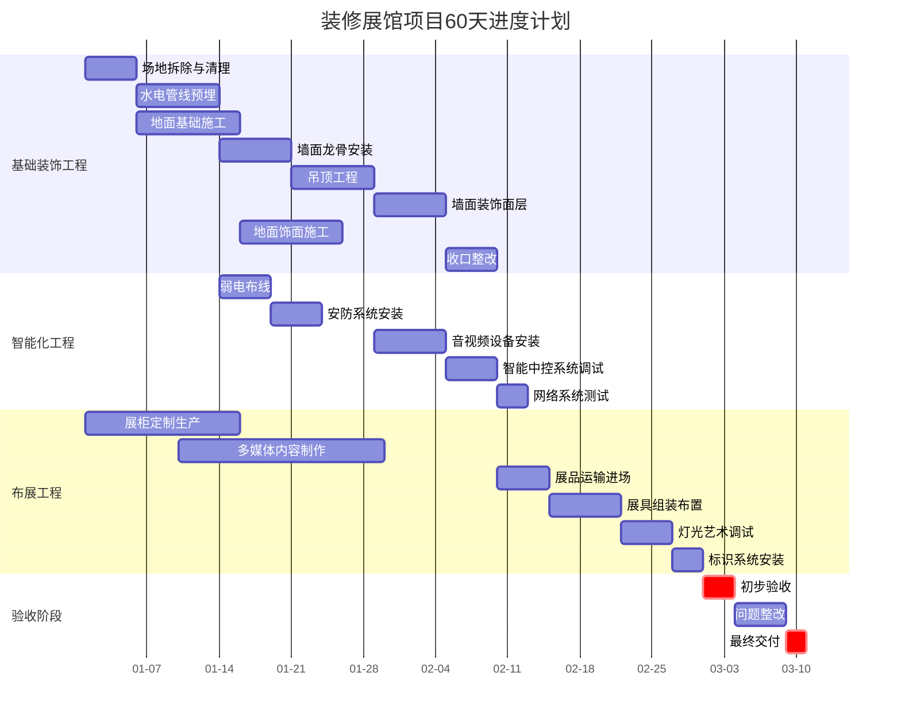

```mermaid
gantt
    title 装修展馆项目60天进度计划
    dateFormat  YYYY-MM-DD
    axisFormat  %m-%d

    section 基础装饰工程
    场地拆除与清理       :a1, 2024-01-01, 5d
    水电管线预埋        :a2, after a1, 8d
    地面基础施工        :a3, after a1, 10d
    墙面龙骨安装        :a4, after a2, 7d
    吊顶工程          :a5, after a4, 8d
    墙面装饰面层       :a6, after a5, 7d
    地面饰面施工       :a7, after a3, 10d
    收口整改         :a8, after a6 a7, 5d

    section 智能化工程
    弱电布线         :b1, after a2, 5d
    安防系统安装      :b2, after b1, 5d
    音视频设备安装    :b3, after a5, 7d
    智能中控系统调试  :b4, after b3, 5d
    网络系统测试     :b5, after b4, 3d

    section 布展工程
    展柜定制生产     :c1, 2024-01-01, 15d
    多媒体内容制作   :c2, 2024-01-10, 20d
    展品运输进场    :c3, after a8, 5d
    展具组装布置    :c4, after c3, 7d
    灯光艺术调试    :c5, after c4, 5d
    标识系统安装    :c6, after c5, 3d

    section 验收阶段
    初步验收       :crit, d1, after a8 b5 c6, 3d
    问题整改       :d2, after d1, 5d
    最终交付       :crit, d3, after d2, 2d
```